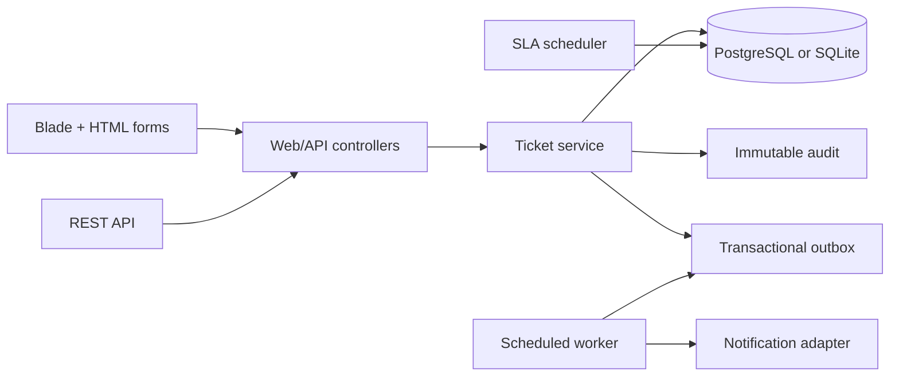

# Secure Service Desk

[](https://github.com/JasonStys/secure-service-desk/actions/workflows/ci.yml)
[](https://github.com/JasonStys/secure-service-desk/actions/workflows/codeql.yml)

A portfolio-grade service-desk application built to make correctness visible. It combines a server-rendered Laravel interface, a versioned JSON API, tenant-safe authorization, an explicit ticket state machine, optimistic concurrency control, immutable audit records, SLA escalation, signed idempotent webhooks, and a transactional outbox with bounded retries.

All people, organizations, tickets, and addresses in the seed data are synthetic.

## What this project demonstrates

- **Backend engineering:** PHP 8.5, Laravel 13, validation, transactions, Eloquent relationships, API design, scheduling, and PostgreSQL-aware search.
- **Reliability:** database-backed outbox delivery, exponential retry delays, dead-letter state, idempotency keys, webhook replay handling, and SLA escalation.
- **Security:** tenant and object authorization in the domain layer, role checks, CSRF on browser mutations, API throttling, HMAC verification, output escaping, bounded inputs, and no committed secrets.
- **Frontend engineering:** semantic HTML, responsive CSS, keyboard-visible focus, reduced-motion support, and optional vanilla JavaScript that leaves core forms functional without scripts.
- **Delivery discipline:** pinned GitHub Actions, PHP and JavaScript tests, PostgreSQL integration tests, formatting, dependency audits, CodeQL, container builds, generated code indexing, and documented evidence.

## Architecture at a glance



Controllers validate transport data; `TicketService` owns tenant checks, authorization, lifecycle rules, and transactional writes. The same transaction writes the domain change, audit entry, and outbox message, so a committed ticket update cannot silently lose its notification intent. See [architecture](docs/architecture.md) and [data model](docs/data-model.md).

## Major features

| Feature | Behavior |
|---|---|
| Ticket lifecycle | `new → open → pending/resolved/closed`, reopen from `resolved`, and terminal `closed`; invalid edges fail validation. |
| Tenant isolation | Agents see their tenant; requesters see only their own tickets; cross-tenant identifiers return `404`. |
| Concurrency safety | Every transition includes an expected version and rejects stale updates. |
| Audit trail | Creation, comments, transitions, and SLA breaches append structured immutable records. |
| Reliable delivery | Outbox messages are deduplicated, processed in bounded batches, retried with backoff, and dead-lettered after three failures. |
| SLA automation | Priority determines the response target; a scheduled command marks each overdue ticket once. |
| Integration API | Versioned JSON endpoints, bounded pagination, request-key idempotency, rate limiting, and signed webhook ingestion. |
| Search | PostgreSQL uses a GIN full-text index; SQLite uses an escaped literal fallback for local development. |
| Progressive UI | All mutations are standard CSRF-protected forms; JavaScript adds live search and transition confirmation. |

## Quick start

Prerequisites: PHP 8.5 with SQLite, Composer 2.10, and Node.js 24.

```bash
cp .env.example .env
composer install
php artisan key:generate
php artisan migrate:fresh --seed
npm ci
npm run build
php artisan serve
```

Open `http://localhost:8000`. The local-only demonstration identity adapter recognizes:

- `agent@northwind.example` — may manage tickets in the synthetic Northwind tenant.
- `requester@northwind.example` — may create, view, and comment on only their own tickets.

The adapter is deliberately isolated behind middleware and is **not production authentication**. Replace it with an identity provider before deployment; domain authorization remains reusable.

For a containerized PostgreSQL environment:

```bash
docker compose up --build
```

## Verification

```bash
bash scripts/verify.sh
```

The gate runs dependency audits, Laravel Pint, PHPUnit, Node tests, a production asset build, and repository-specific policy checks. The CI suite additionally uses PostgreSQL and builds the non-root container image. Current evidence is recorded in [test results](docs/reports/test-results.md), [security validation](docs/reports/security-validation.md), and [validation results](docs/reports/validation-results.md).

## API example

```bash
curl -X POST http://localhost:8000/api/v1/tickets \
  -H 'Accept: application/json' \
  -H 'Content-Type: application/json' \
  -H 'X-Demo-Actor: requester@northwind.example' \
  -d '{"title":"Export delayed","description":"Expected data has not arrived.","priority":"high","request_key":"client-42"}'
```

The complete contract is in [OpenAPI](docs/openapi.yaml) and the human-readable [API guide](docs/api.md).

## Repository map

| Path | Purpose |
|---|---|
| `app/Enums/` | Roles, priorities, SLA targets, states, and transition rules. |
| `app/Http/Controllers/` | Thin browser/API transport adapters and validation. |
| `app/Http/Middleware/` | Demonstration actor resolution; replaceable at the application boundary. |
| `app/Models/` | Typed Eloquent entities and tenant-scoped query behavior. |
| `app/Services/TicketService.php` | Central authorization, transactions, audit, and outbox writes. |
| `app/Services/OutboxProcessor.php` | Bounded delivery with retry and dead-letter handling. |
| `app/Services/SlaEscalationService.php` | Idempotent scheduled SLA breach handling. |
| `app/Services/WebhookService.php` | Replay-safe webhook receipt persistence. |
| `database/migrations/` | Relational constraints, operational indexes, and PostgreSQL full-text index. |
| `database/seeders/` | Synthetic multi-tenant demonstration data. |
| `resources/views/` | Escaping-by-default semantic HTML dashboard. |
| `resources/css/` | Responsive, high-contrast visual system. |
| `resources/js/` | Optional live filtering and confirmation behavior. |
| `routes/` | Browser, API, worker, and scheduler entry points. |
| `tests/` | Lifecycle, authorization, injection, escaping, webhook, outbox, SLA, and frontend tests. |
| `tools/validate_repo.php` | Reproducible documentation, header, action-pin, link, and secret checks. |
| `docs/code-index.md` | Generated exact locations for symbols and variables in every authored code file. |
| `.github/workflows/` | CI and CodeQL automation. |
| `Dockerfile` / `compose.yaml` | Non-root application image and local PostgreSQL stack. |

## Documentation

- [Architecture](docs/architecture.md)
- [API](docs/api.md)
- [Complexity and performance](docs/complexity.md)
- [Data model](docs/data-model.md)
- [Operations and recovery](docs/operations.md)
- [Technology research](docs/research.md)
- [Security model](docs/security.md)
- [Testing strategy](docs/testing.md)
- [Code index](docs/code-index.md)

## Scope

This repository is a focused engineering case study, not a hosted support product. Email/SMS delivery is represented by a replaceable log adapter; production identity, object storage, observability export, and managed secret storage are documented integration boundaries rather than simulated credentials.

## License

MIT — see [LICENSE](LICENSE).
