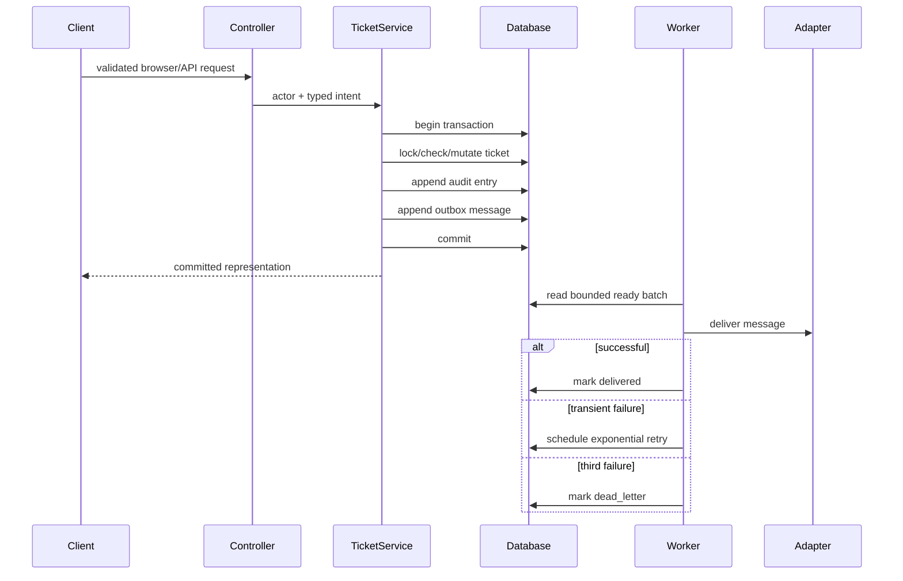

# Architecture

## Goals

The system prioritizes visible correctness: tenant isolation, explicit state transitions, recoverable integration work, small transport adapters, and reproducible verification. It supports SQLite for a low-friction local loop and PostgreSQL for production-oriented integration behavior.

## Component flow

## Boundaries

- **Transport:** controllers validate shape and translate HTTP responses. They do not decide tenant access or state transitions.
- **Domain/service:** `TicketService` enforces object access, roles, lifecycle edges, optimistic locks, and atomic side effects.
- **Persistence:** database constraints backstop tenant ownership, uniqueness, foreign keys, and query access paths.
- **Delivery:** `OutboxProcessor` accepts a replaceable delivery closure. The sample command logs delivery without embedding email vendor credentials.
- **Identity:** `ResolveDemoActor` provides deterministic local identities. A production identity provider can replace it without moving authorization out of the domain layer.

## Important decisions

### Transactional outbox

Writing an external notification during a ticket transaction creates a dual-write failure: either the database or external system can succeed alone. Instead, the ticket mutation, audit record, and delivery intent commit together. Delivery is asynchronous and at-least-once; the unique deduplication key lets adapters suppress duplicate effects.

### Optimistic versioning

Tickets carry an integer `version`. A status request supplies the version it observed. The service locks the row and rejects stale versions, preventing two agents from silently overwriting one another.

### Server rendering with optional JavaScript

The primary workflow is standard HTML and Laravel validation. JavaScript improves local filtering and confirmation but is not required for ticket creation, comments, transitions, filters, or pagination. This reduces client state and creates a clear accessibility baseline.

### Database portability with a production fast path

Queries use Eloquent and parameter binding on both engines. PostgreSQL gets a GIN expression index and `whereFullText`; SQLite uses escaped `LIKE` for tests and local demonstrations. Database-specific behavior is integration-tested in CI.

## Failure modes

| Failure | Handling |
|---|---|
| Duplicate create request | Tenant-scoped `request_key` returns the existing ticket. |
| Stale transition | `version` mismatch returns validation error; no partial audit/outbox writes. |
| Invalid lifecycle edge | Explicit state matrix rejects it. |
| Cross-tenant identifier | Domain lookup converts it to `404`, reducing enumeration leakage. |
| Notification outage | Exponential retry followed by inspectable dead-letter state. |
| Worker overlap | Scheduler uses `withoutOverlapping`; row locks protect individual processing. |
| Webhook replay | Stored event key/hash returns the original result; changed payload conflicts. |
| SLA scheduler replay | `sla_breached_at` makes escalation idempotent. |

## Deployment topology

A production deployment separates the web process, scheduler, and outbox worker while sharing PostgreSQL and centralized logs. Run at least two web replicas behind HTTPS, exactly one scheduler leader, and one or more workers. Health checks use `/up`; readiness should additionally verify database access in the hosting platform.
