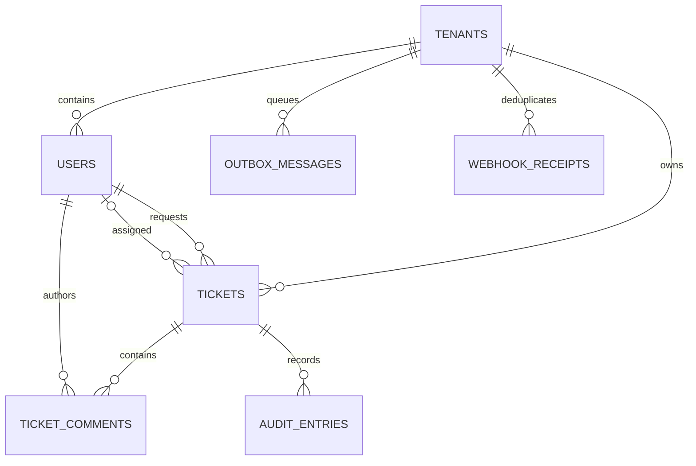
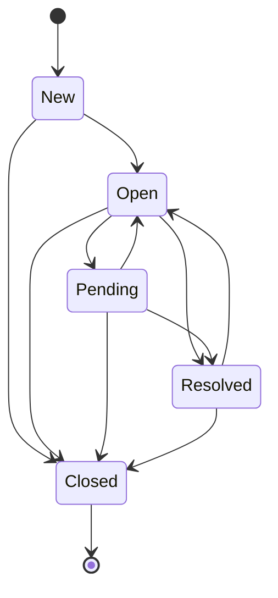

# Data model

## Tables and invariants

| Table | Purpose | Key invariants/indexes |
|---|---|---|
| `tenants` | Isolation root. | Unique slug. |
| `users` | Actors and roles. | Tenant/role index; tenant foreign key restricts deletion. |
| `tickets` | Request content and lifecycle. | UUID public id; unique tenant/request key; tenant/status/priority, tenant/SLA, and requester/time indexes; version ≥ 1 by service rule. |
| `ticket_comments` | Plain-text discussion. | Tenant copied for auditability; ticket/time index. |
| `audit_entries` | Append-only domain history. | No `updated_at`; tenant/time index. Application exposes no update operation. |
| `outbox_messages` | Reliable integration work. | Globally unique deduplication key; status/availability index. |
| `webhook_receipts` | Replay ledger. | Unique tenant/provider/external event id plus content hash. |

PostgreSQL adds a GIN index on an English `to_tsvector` expression over ticket title and description. The service always applies tenant predicates independently of the search predicate.

## Lifecycle

The enum is the single transition source of truth. UI options are derived from it, but the service rechecks every request so clients cannot bypass the rule.

## Retention guidance

- Tickets/comments: retain according to product and contractual requirements; support tenant-scoped export and erasure workflows before production.
- Audit entries: use a documented legal/security retention window and archive partitions instead of in-place edits.
- Delivered outbox: delete or archive after a short operational window once correlated logs are retained.
- Dead letters: retain until resolved, then archive with incident reference.
- Webhook receipts: retain longer than the provider's maximum retry interval.
