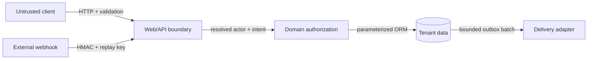

# Security model

## Trust boundaries

Inputs, route identifiers, query strings, headers, webhook content, and stored ticket text are untrusted. The application database is trusted only to the extent guaranteed by constraints; domain checks remain mandatory.

## Control matrix

| Risk | Control | Evidence |
|---|---|---|
| Broken object authorization | Every service operation compares tenant; requester visibility is object-specific; concealed objects return `404`. | `TicketWorkflowTest::test_object_authorization_prevents_ticket_disclosure` |
| Role escalation | Status transitions require agent/admin in `TicketService`, below all controllers. | `test_requester_cannot_transition_ticket` |
| SQL injection | Eloquent/query binding; SQLite wildcard escaping; PostgreSQL full-text API. | adversarial search test and code review |
| Stored XSS | Blade escaped interpolation; comments treated as text; no raw HTML rendering. | dashboard escaping test |
| CSRF | Browser mutations use the Laravel `web` middleware and `@csrf`; JSON API is separate. | route inspection and rendered forms |
| Webhook forgery/replay | Exact-body HMAC with `hash_equals`; event key/hash ledger; changed replays conflict. | webhook signature/idempotency tests |
| Brute force/resource abuse | 60/minute per actor, field limits, list/batch limits, token cap. | validation rules and API configuration |
| Lost notification | Domain/audit/outbox atomic transaction; retries/dead-letter state. | creation and outbox failure tests |
| Concurrent overwrite | Row lock plus expected ticket version. | stale-transition test |
| Secret exposure | `.env` ignored; example values are explicit local placeholders; repository scanner checks key patterns. | repository validation |
| Dependency compromise | Lockfiles, Composer/npm audits, minimal dependencies, automated update PRs, CodeQL. | CI workflows |

## Authentication boundary

`ResolveDemoActor` accepts a synthetic email header/query value in this portfolio build. It is intentionally conspicuous and is not safe for public deployment. Replace the middleware with OIDC/SAML/session authentication, remove query-based identity selection, and preserve the `User` actor contract. Use short sessions, secure/HTTP-only/same-site cookies, MFA for agents, and an administrative session revocation path.

## Deployment checklist

- Generate a unique `APP_KEY` and high-entropy `WEBHOOK_SECRET` through managed secrets.
- Set `APP_ENV=production`, `APP_DEBUG=false`, secure cookie settings, trusted proxies, and HTTPS/HSTS at the edge.
- Use a least-privilege PostgreSQL role; prohibit public database access; encrypt backups.
- Run web, scheduler, and worker as non-root identities with a read-only application filesystem except required cache/log paths.
- Export structured logs without request bodies, credentials, or ticket descriptions.
- Alert on authorization spikes, HMAC failures, dead letters, overdue SLA scans, migration failure, and backup restore failure.
- Review retention/privacy requirements before storing real tickets or user information.

## Residual risks

The demonstration adapter, log-only delivery adapter, and single-process container command are explicit portfolio boundaries. Malware scanning/object storage for attachments, verified email delivery, enterprise SSO, full audit immutability at the database role level, and multi-region disaster recovery are not claimed.
